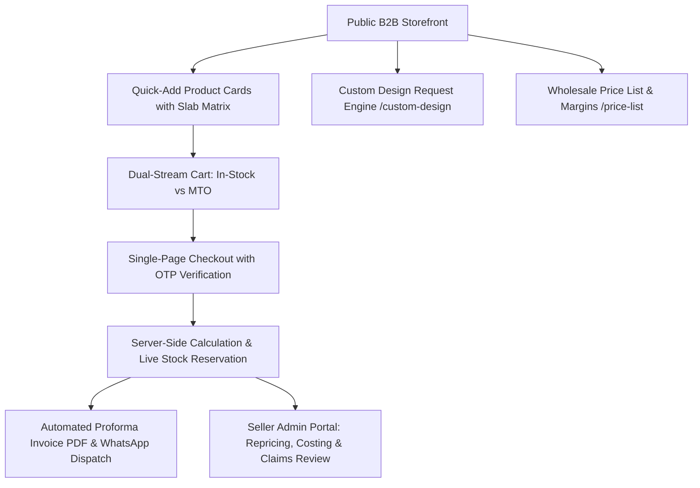

# R3 Exports — B2B Website & ERP Master Implementation Plan

**Prepared for:** Rahul Gupta, R3 Exports (Agra, India)  
**Reference Sources:** `R3_Website_Features.pdf` (94 Features), `R3_Developer_Handover` (`02_Developer_Specification.md`, `04_Database_Schema.sql`, `06_Reference_Mockup.html`)  
**Date:** 27 September 2026 · **Status:** Implementation Ready  

---

## 1. Executive Summary & Scope

R3 Exports is an Agra-based manufacturer of high-grade borosilicate glassware selling to hospitality (hotels, cafés, restaurants), corporate gifting buyers, and B2B retailers/distributors. 

The website operates as a high-conversion **B2B Catalogue & Ordering Platform** with public trade pricing, dual buying streams (Ready Stock vs Made-to-Order), dynamic quantity break tiers, live container volume/weight calculations, and direct ERP/proforma invoice integration.

```
┌────────────────────────────────────────────────────────────────────────┐
│  TOTAL FEATURES BREAKDOWN (94 Features Total)                          │
│  • 71 Core Mock-Up Features (Catalog, Quick-Add, Margin Engine)        │
│  • 17 Launch Backend & Validation Tasks (Server Validation, Credits)   │
│  • 6 Phase 2 Future Upgrades (Online Gateway, Auto Reorder, CRM Sync)  │
└────────────────────────────────────────────────────────────────────────┘
```

---

## 2. Core Trade Terms & Business Rules

Every business rule below is programmatically enforced across product cards, the order calculator, checkout, and generated proforma invoices:

| Business Term | Programmatic Specification |
| :--- | :--- |
| **Two Buying Paths** | • **Ready Stock:** 100% advance payment, dispatch $\le$ 2 days.<br>• **Made to Order:** 30% advance with confirmation, 70% before dispatch. Lead time: 20–30 working days. |
| **Minimum Order Values (MOV)** | • **In-Stock:** Minimum order value of **₹15,000** across in-stock lines.<br>• **Made-to-Order:** **₹50,000 to ₹1,00,000** per design (set per SKU). |
| **Packaging Multiples** | Products are packed strictly in **2, 4, or 6-piece master boxes**. Quantities entered automatically round **up** to whole boxes. |
| **4 Quantity Price Slabs** | Slabs based on total SKU quantity in order:<br>1. **1–99 pcs:** Base Trade Price (0% off)<br>2. **100–299 pcs:** 5% discount<br>3. **300–499 pcs:** 10% discount<br>4. **500+ pcs:** 20% discount |
| **Suggested Retail Price (SRP) & Margins** | Every product displays Suggested Retail Price (including GST).<br>• $\text{Buyer Cost} = \text{Unit Price} \times (1 + \text{GST Rate})$<br>• $\text{Retail Margin \%} = \frac{\text{SRP} - \text{Buyer Cost}}{\text{SRP}} \times 100$<br>• $\text{Markup Multiple} = \frac{\text{SRP}}{\text{Buyer Cost}}$ |
| **Sample Policy** | • **₹500 per piece** (in-stock items only, paid 100% upfront).<br>• Auto-generates a **₹500 Sample Credit** on the buyer's account, automatically deducted on their next order. |
| **Logo Branding** | • **+₹30 per piece** baked logo charge.<br>• Minimum 500 pcs per SKU or 1,000 pcs across mixed designs. |
| **Delivery & Transit Breakage** | • **Option 1 (R3 Courier):** Shipping charged by weight/SKU. Transit breakage is **credited on the buyer's next order** upon uploading unboxing video of every damaged piece (no cash refunds).<br>• **Option 2 (Buyer's Own Transporter):** ₹0 shipping (ex-works Agra). **Transit breakage is not covered**. |
| **GST Taxation** | • Indicative 18% GST (HSN 7013).<br>• **Intra-State (Uttar Pradesh - 09):** CGST 9% + SGST 9%<br>• **Inter-State (Outside UP):** IGST 18% |

---

## 3. System Architecture & Feature Gap Map



### Gap Analysis & Action Items

```
[✓ COMPLETED]  1. Dedicated Authentication & Clean Login Form (clutter removed).
[✓ COMPLETED]  2. Multi-Currency Export Engine (USD $, EUR €, GBP £, AED د.إ, INR ₹).
[✓ COMPLETED]  3. Export Packing, CBM Container Analyzer & WhatsApp dispatch.
[TO BUILD]     4. Public B2B Storefront & 7 Glassware Category Pages.
[TO BUILD]     5. Interactive Quick-Add on Product Cards (4 Slabs + Box Rounding).
[TO BUILD]     6. Public Sortable Wholesale Price List (`/price-list`) with Excel export.
[TO BUILD]     7. Custom Design Request Engine with 1–5 image/PDF drag-and-drop upload.
[TO BUILD]     8. Split-Order Cart (`/cart`) with In-Stock (₹15k) & MTO (₹50k) progress bars.
[TO BUILD]     9. Single-Page Checkout (`/checkout`) with delivery selector & breakage terms.
[TO BUILD]    10. Transit Breakage Video Claim Workflow & Automated Credit Notes.
[TO BUILD]    11. Admin Catalogue Bulk Repricing Tool (+X% / -X%) with Preview & Undo.
[TO BUILD]    12. Confidential Unit Costing & Gross Margin Visibility restricted to Super Admin.
```

---

## 4. Detailed Component Specifications

### 4.1. Public Product Grid & Quick-Add Component (`src/components/storefront/QuickAddProductCard.tsx`)
- **Card Header:** Product badges (`Trending`, `Best seller`, `New design`, `Clearance`), like button with count, live availability badge (`In stock · 420 pcs` vs `Made to order · 20–30 days`).
- **4-Slab Interactive Matrix:**
  - Cells for `1–99`, `100–299`, `300–499`, `500+` pieces with dynamic per-piece rate.
  - Active slab highlighted; unreachable slabs greyed out with descriptive tooltip (*"Not enough stock"* or *"Below MOQ"*).
- **Packaging Selector:** Segmented buttons for allowed box sizes (`2-pc`, `4-pc`, `6-pc`).
- **Quantity Stepper:** Increments by whole box size; typed input rounds up automatically.
- **Dynamic Line Summary:** Displays live line total `₹X + GST` and upsell nudges (*"Add 90 more pcs to get ₹113.05/pc"*).
- **Cart Sync:** Shows *"In your order: N pcs"* once added.

---

### 4.2. Public Wholesale Price List (`src/app/(storefront)/price-list/page.tsx`)
- Sortable and filterable data table containing:
  1. Product Thumbnail & Name
  2. SKU & Category
  3. Availability (In-Stock / MTO)
  4. Base Trade Price (ex-GST)
  5. Trade Price (incl. 18% GST)
  6. Suggested Retail Price (SRP)
  7. Retail Margin per Piece (₹)
  8. Retail Margin (%)
  9. Markup Multiple (e.g. 1.85x)
- Slabs switcher: Recalculates all table values across `1–99`, `100–299`, `300–499`, and `500+` tiers in real time.
- **Download Price List:** 1-Click Excel (.xlsx) / CSV export formatted for B2B procurement teams.

---

### 4.3. Custom Design Request Engine (`src/app/(storefront)/custom-design/page.tsx`)
- **Request Types:** *New custom design, Change existing catalogue product, Logo branding, Special packaging, Other*.
- **Upload Dropzone:** 1 to 5 files (JPG, PNG, WEBP, HEIC, PDF) with client-side image compression.
- **Spec Details:** Target product base, description (up to 2,000 chars), expected quantity slab (`100–249`, `250–499`, `500–999`, `1000+`), timeline.
- **Verification & Tracking:** Mobile verification via OTP; generates unique tracking ID: `CR-YYMMDD-XXXX`.
- **Admin Review:** Dedicated custom requests review queue with status management (`New`, `Reviewing`, `Quoted`, `Won`, `Lost`).

---

### 4.4. Dual-Stream Cart & Single-Page Checkout
- **Cart Grouping (`src/app/(storefront)/cart/page.tsx`):**
  - **In-Stock Group:** Progress bar tracking towards ₹15,000 minimum order value.
  - **Made-to-Order Group:** Progress bar tracking towards ₹50,000 design minimum.
  - **Samples Group:** Lists sample units (₹500 each).
- **Checkout (`src/app/(storefront)/checkout/page.tsx`):**
  - Delivery Method Radio:
    - `r3_courier`: Weight-based shipping calculated; breakage covered with unboxing video.
    - `buyer_transport`: ₹0 shipping (ex-works Agra); breakage not covered.
  - Payment Schedule Split:
    - **Amount Payable Now:** 100% of In-Stock items + Samples + 30% of Made-to-Order items.
    - **Amount Payable Before Dispatch:** 70% of Made-to-Order balance.
  - Mandatory Breakage Checkbox & Terms of Sale acceptance.

---

### 4.5. Breakage Claims & Credit Notes (`src/app/(dashboard)/breakage-claims/page.tsx`)
- **Buyer Submission:** Upload video of unboxing + photo of broken pieces against delivered order ID within 48 hours.
- **Staff Approval Queue:** Admin checks order delivery method (blocked if buyer arranged transport), reviews video evidence, and approves credit amount.
- **Automated Credit Note:** Generates a credit balance on the customer account that auto-deducts on their next order.

---

### 4.6. Admin Catalogue Bulk Repricing (`src/app/(dashboard)/catalog/repricing/page.tsx`)
- **Repricing Scope:** All products, In-stock only, Made-to-order only, or by Category.
- **Percentage Adjustment:** Input range from -50% to +100%.
- **Live Impact Preview:** Shows current price vs new price, SRP update, and flags any product where the 500+ slab falls below base cost price.
- **Undo / Price History:** Audit log of all repricing operations with 1-click restore.

---

## 5. Implementation Phasing & Milestones

| Phase | Deliverables | Target Timeline |
| :--- | :--- | :--- |
| **Phase 1: Storefront Core** | • Public Catalogue with 7 categories<br>• Quick-Add on Product Cards with 4-slab pricing & box rounding<br>• Public Wholesale Price List (`/price-list`) with CSV export | Days 1–3 |
| **Phase 2: Checkout & Custom Orders** | • Dual-stream Cart with MOV progress bars<br>• Single-page checkout with delivery selector & payment schedule<br>• Custom Design Request upload portal (`/custom-design`) | Days 4–6 |
| **Phase 3: Back-Office & Claims** | • Breakage Video Claims portal & automated credit note generation<br>• Bulk Catalogue Repricing tool with rollback<br>• Super Admin confidential unit costing lock | Days 7–8 |
| **Phase 4: Launch Verification** | • Execution of all 71 Acceptance Tests from handover pack<br>• Mobile responsive audit & SEO metadata verification | Day 9 |

---

*This document is stored at [`R3_WEBSITE_IMPLEMENTATION_PLAN.md`](file:///c:/Users/hawk1/OneDrive/Desktop/📁%20Work%20Projects/erp/erp/R3_WEBSITE_IMPLEMENTATION_PLAN.md).*
